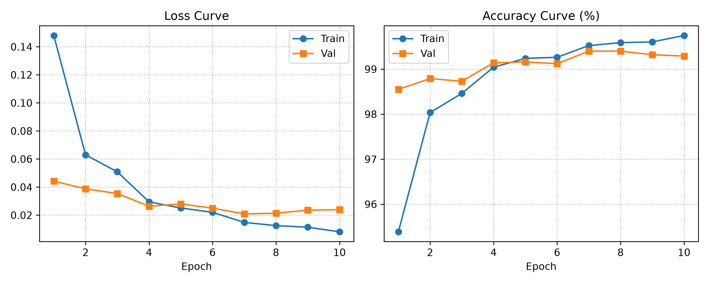

# pytorch_handwritten_digits

Draw a digit, watch a PyTorch CNN recognize it live. A compact network
(< 450k params) trained to **~99.3% MNIST test accuracy**, served through a
minimal Gradio drawing app with real-time predictions.


[](https://colab.research.google.com/drive/1wXZBv274Y_Fzny7CFTi8A30CfBXjfY3U?usp=sharing)

## What it does

- **Draw** a digit (0–9) with a black pencil on a white canvas, eraser included.
- **Classify** instantly — top-3 confidences update as you draw, or on button press.
- **Clear** with one button that reliably resets both canvas and predictions.

## Results



10 epochs, Adam + StepLR, no augmentation: train/val curves converge together
to ~99.3% validation accuracy. See [docs/training.md](docs/training.md).

## Quickstart

```bash
pip install -r requirements.txt

# Train (downloads MNIST on first run, saves best model to checkpoints/)
python train.py --epochs 10

# Or skip training and use the Colab notebook above,
# then copy mnist_cnn.pth into checkpoints/

# Launch the demo
python app.py
# → http://127.0.0.1:7860
```

## Project structure

```text
├── app.py                 # Gradio UI + inference pipeline
├── train.py               # training loop (Adam, StepLR, best-checkpoint saving)
├── requirements.txt       # pinned dependencies
├── assets/                # training_curves.png (results plot)
├── checkpoints/           # mnist_cnn.pth lives here (git-ignored, reproducible)
├── data/                  # MNIST archives (auto-downloaded, git-ignored)
├── docs/                  # how each piece works (linked below)
└── src/
    ├── model.py           # DigitCNN architecture
    ├── dataset.py         # dependency-free IDX parsing + dataloaders
    └── utils.py           # device detection, canvas preprocessing, curve plots
```

## How it works

| Piece | Doc |
|---|---|
| CNN architecture (conv blocks, classifier head) | [docs/model.md](docs/model.md) |
| Canvas drawing → 28×28 model tensor | [docs/preprocessing.md](docs/preprocessing.md) |
| Data, loop, curves, Colab training | [docs/training.md](docs/training.md) |
| Live demo, events, reliability hardening | [docs/app.md](docs/app.md) |

## Tech stack

PyTorch (model + training) · Gradio 6 (canvas UI) · Pillow/NumPy (preprocessing) ·
Matplotlib (plots) · Python 3.10+

## License

MIT — see [LICENSE](LICENSE).
